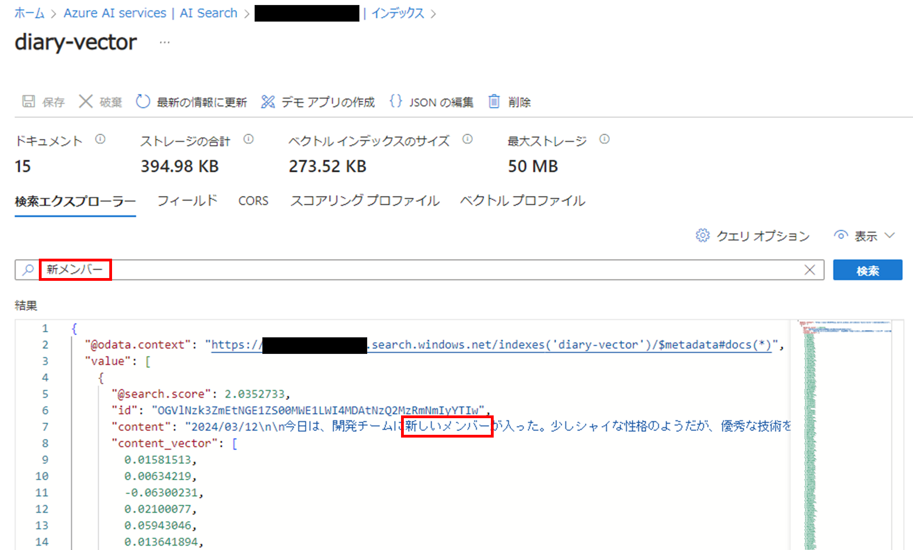
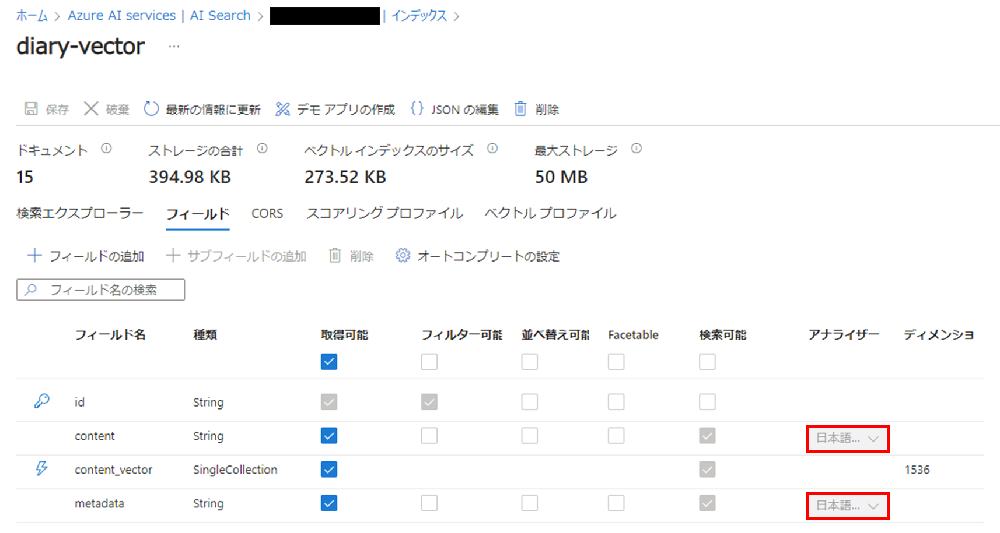
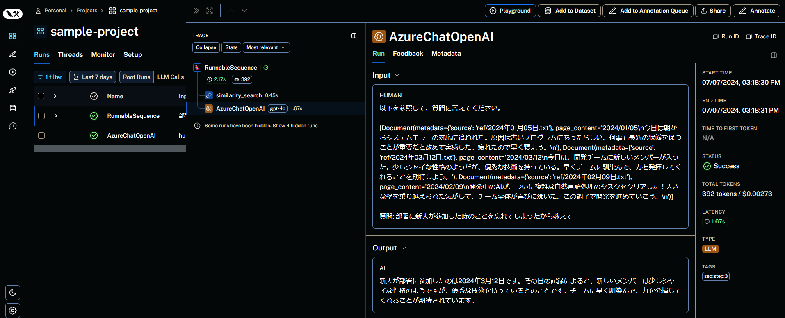

# RAG with Azure AI Search

## Overview
Azure AI Search を用いて、RAG（Retrieval-Augmented Generation）を実装する

## Environment Setup
VSCode の Dev Containers を利用して、開発環境を構築する

## Setup Instructions
`.env.sample` をもとに `.env` ファイルを作成し、必要な情報を記述する

## How to Use
1. `python azsearch_upload.py` を実行して Azure AI Search にベクトルデータベースを登録
2. `python azsearch_chat.py` を実行してベクトル化されたデータをもとに回答を生成
3. 比較として、Chroma によるベクトルデータベースを用いた RAG を実装 (`python chroma_pdf.py`)

## Notes
* LCEL 記法について：https://zenn.dev/os1ma/articles/acd3472c3a6755
* ベクトル化の必要性：読み込んだコンテンツがテキストのままだとテキストによる検索しかできないが、ベクトル化しておくことにより数値ベクトルでの類似性検索が可能に
* Azure AI Search について
    * LangChain ドキュメント：https://python.langchain.com/v0.1/docs/integrations/vectorstores/azuresearch/
    * [AI Search] > [作成した検索サービス] > [インデックス] > [dairy-vector] で登録されたベクトルデータベースの参照と検索が可能
      
    * インデックスの定義の際に `analyzer_name="ja.microsoft"` とすることで、単語の分割や品詞解析を行うアナライザーを、日本語に特化したものに設定できる
      
* retriever について
    ```python
    retriever = RunnableLambda(vector_store.similarity_search).bind(k=3, search_type="hybrid")
    ```
    * `RunnableLambda`：関数をラップして、後で実行できるようにする
      * 本来は `vector_store.similarity_search(k=3, search_type="hybrid")` という形で実行する
    * `bind` メソッド：`RunnableLambda` に引数をバインドする
* LangSmith：https://smith.langchain.com/
  

## References
* [langchainを活用してAzureAISearch×GeminiでRAGをつくる](https://zenn.dev/tomodo_ysys/articles/azure-ai-search-langchain-rag)
* [RAG｜ChatGPTの能力を底上げする技術](https://www.youtube.com/watch?v=L1tDr3C7z-Q&t=1148s)
* [【初心者向け】LangChainの開発効率を爆上げする必須ツール「LangSmith」の入門](https://rakuraku-engineer.com/posts/langsmith/)
